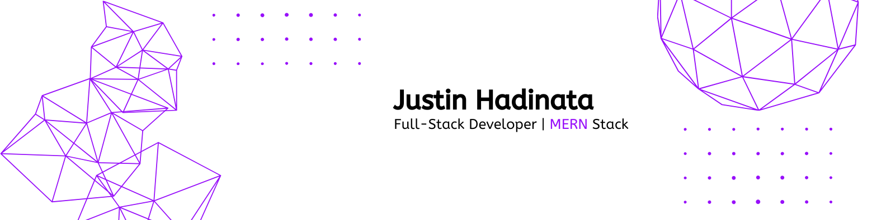

I'm a Computer Science student at Binus International with hands-on experience building complex web applications. I enjoy tackling challenges and learning new technologies.

## 💻 Tech Stacks

## ⚡ Stats

